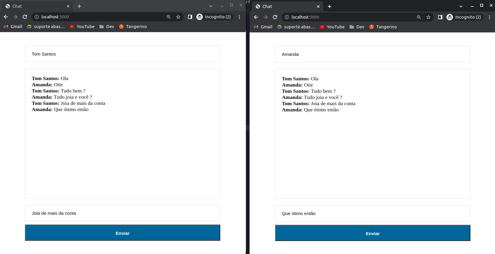

# Chat with socket.io
## Objectve
 Create simple communication chat using current technologies. The chat allows communication between several people maintaining continuity between them through a socket.
Users can enter their name and write a message to the entire group.

## Motivation

Learn more about new technologies in the job market and improve my knowledge in javascript.

## Use
- Make a clone of the repository
```
cd Chat-with-socket.io
npm i
node server.js
```

- Open in browser http://localhost:3000



